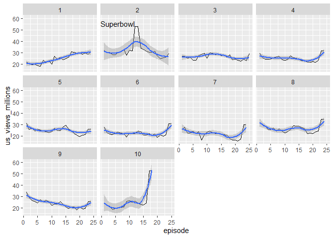
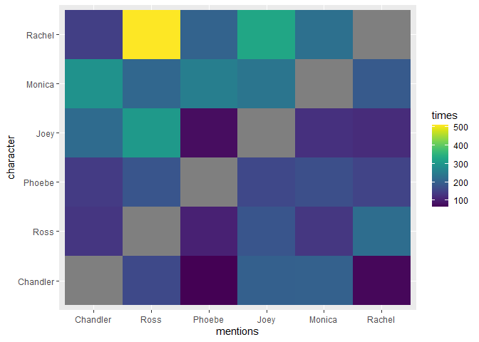

Tidytuesday Friends data
================

``` r
# Package loads
library(ggplot2)
library(reshape2)
library(viridis)
```

    ## Loading required package: viridisLite

The data load. This is a list of three data frames as per the
tidytuesday page
<https://github.com/rfordatascience/tidytuesday/blob/master/data/2020/2020-09-08/readme.md>

``` r
tuesdata <- tidytuesdayR::tt_load('2020-09-08')
```

    ## 
    ##  Downloading file 1 of 3: `friends.csv`
    ##  Downloading file 2 of 3: `friends_info.csv`
    ##  Downloading file 3 of 3: `friends_emotions.csv`

**Audience over time**

  - The rise and fall
  - the double episode cliffhanger trick at the end of every season from
    4 onwards
  - the superbowl assisted ratings boost in season 2
    <https://en.wikipedia.org/wiki/The_One_After_the_Superbowl>

<!-- end list -->

``` r
info <- tuesdata$friends_info

# subset frame to identify the "superbowl" episodes in season 2
sb <- info[grep("Superbowl", info$title),]

# using geom_text(data=sb,...) so the text only appears in the
# season 2 facet 
ggplot(data=info, aes(x=episode, y=us_views_millions)) + geom_line() +
  geom_smooth() + facet_wrap(vars(season)) + 
  geom_text(data=sb[1,], label="Superbowl", vjust="bottom", hjust="right")
```

    ## `geom_smooth()` using method = 'loess' and formula 'y ~ x'

<!-- -->

**Heatmap**

how many times each character mentions the other characters.

``` r
# the "quotes" data
friends <- tuesdata$friends

# subset to quotes from the main characters
main.characters <- c("Monica Geller", "Joey Tribbiani",
                     "Chandler Bing", "Phoebe Buffay", 
                     "Ross Geller", "Rachel Green")
# extract first names
first.names <- strsplit(main.characters," ")
first.names <- unlist(lapply(first.names, function(x) x[1]))

main <- subset(friends, speaker%in%main.characters)

# create a matrix where each element gives the number of times
# each "row" character mentions the "column" character
out <- matrix(0, nrow=length(first.names), ncol=length(first.names),
              dimnames=list(first.names, first.names))

for(i in first.names){
  for(j in first.names){
    dd <- main[grep(i, main$speaker),]
    out[i,j] <- length(grep(j, dd$text))
  }
}

# set self mentions to missing. This makes a more readable heatmap
diag(out) <- NA

# sort rows and columns according to number of names mentioned
tots <- sort(apply(out, 1, sum, na.rm=TRUE))
out <- out[names(tots), names(tots)]

# ggplot likes "long" format data so using function melt from reshape2
out1 <- melt(out)
names(out1) <- c("character","mentions","times")

ggplot(data=out1, aes(x=mentions, y=character, fill=times)) + geom_tile() +
  scale_fill_viridis(discrete=FALSE)
```

<!-- -->
